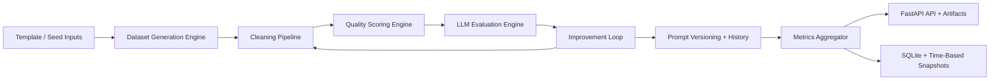
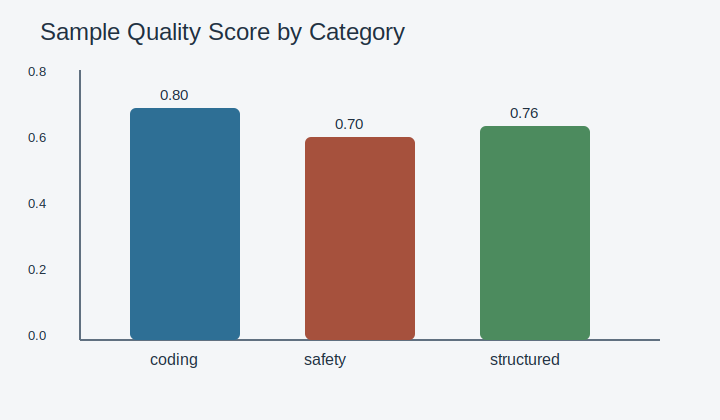

# E.D.E.N. - Evolving Dataset Evaluation Engine for LLMs
# Self-Evolving Dataset & Evaluation Engine

E.D.E.N. is a backend-first AI infrastructure project for building, cleaning, scoring, evaluating, and iteratively improving prompt datasets for large language models.

The project focuses on dataset quality, model comparison, and experiment tracking rather than chat UI:

- structured prompt dataset generation
- cleaning and semantic deduplication
- transparent quality scoring
- multi-backend LLM evaluation
- automatic weak-prompt improvement
- experiment logging and SQLite persistence
- metrics snapshots and trend tracking

The main goal is to keep the prompt dataset itself under measurement and version control:

- better prompts create better benchmarks
- better benchmarks expose real model differences
- better measurements create a more reliable improvement loop

## Architecture



## Folder Tree

```text
EDEN/
├── ARCHITECTURE_PLAN.md
├── README.md
├── backend/
│   ├── .env.example
│   ├── app/
│   │   ├── api/
│   │   │   ├── router.py
│   │   │   └── routes/
│   │   │       ├── datasets.py
│   │   │       ├── health.py
│   │   │       ├── metrics.py
│   │   │       ├── pipeline.py
│   │   │       └── runs.py
│   │   ├── core/
│   │   │   ├── config.py
│   │   │   └── logging.py
│   │   ├── db/
│   │   │   ├── base.py
│   │   │   └── session.py
│   │   ├── evaluators/
│   │   │   ├── base.py
│   │   │   ├── factory.py
│   │   │   ├── heuristics.py
│   │   │   ├── huggingface.py
│   │   │   ├── mock.py
│   │   │   ├── ollama.py
│   │   │   └── openai_evaluator.py
│   │   ├── generators/
│   │   │   ├── dataset_generator.py
│   │   │   └── template_library.py
│   │   ├── improvement/
│   │   │   └── rewriter.py
│   │   ├── models/
│   │   │   ├── base.py
│   │   │   ├── dataset.py
│   │   │   ├── evaluation.py
│   │   │   ├── improvement.py
│   │   │   ├── metrics.py
│   │   │   ├── prompt.py
│   │   │   └── score.py
│   │   ├── monitoring/
│   │   │   └── aggregator.py
│   │   ├── schemas/
│   │   │   ├── common.py
│   │   │   ├── dataset.py
│   │   │   ├── evaluation.py
│   │   │   ├── improvement.py
│   │   │   ├── metrics.py
│   │   │   └── scoring.py
│   │   ├── scoring/
│   │   │   └── quality.py
│   │   ├── services/
│   │   │   ├── cleaning_service.py
│   │   │   ├── evaluation_service.py
│   │   │   ├── generation_service.py
│   │   │   ├── improvement_service.py
│   │   │   └── scoring_service.py
│   │   ├── utils/
│   │   │   ├── artifacts.py
│   │   │   ├── categories.py
│   │   │   ├── ids.py
│   │   │   ├── similarity.py
│   │   │   ├── text.py
│   │   │   └── time.py
│   │   └── main.py
│   ├── requirements.txt
│   └── tests/
│       ├── conftest.py
│       ├── test_api.py
│       ├── test_generation.py
│       └── test_pipeline_services.py
├── data/
│   ├── cleaned/
│   │   └── sample_dataset.json
│   ├── generated/
│   │   └── sample_dataset.json
│   ├── raw/
│   │   └── seed_templates.json
│   └── scored/
│       └── sample_dataset.json
├── evaluation/
│   ├── charts/
│   │   └── sample_quality_by_category.svg
│   ├── sample_metrics.json
│   └── sample_run.json
├── logs/
└── notebooks/
    └── demo_pipeline.py
```

## Dataset Lifecycle

E.D.E.N. centers on a continuous refinement loop:

`generate -> clean -> score -> evaluate -> improve -> track -> repeat`

### 1. Generate

- Uses seeded category templates and deterministic randomness
- Supports categories like coding, reasoning, summarization, explanation, factual QA, instruction following, safety-sensitive refusal, and structured output
- Can optionally add LLM-assisted flavoring

### 2. Clean

- normalizes whitespace and punctuation
- removes exact duplicates
- removes semantic near-duplicates
- flags low-information prompts
- auto-categorizes missing categories with keyword rules

### 3. Score

Each prompt receives a transparent quality score:

```text
quality_score =
  0.20 * clarity +
  0.15 * specificity +
  0.15 * usefulness +
  0.15 * inverse_ambiguity +
  0.15 * diversity_contribution +
  0.10 * category_fit +
  0.10 * semantic_novelty
```

Additional auxiliary signal:

- lexical complexity

### 4. Evaluate

Evaluates active prompts against:

- `mock` backend for local demos and tests
- OpenAI API backend
- Ollama local backend
- Hugging Face local backend

Tracked metrics include:

- latency
- response length
- failure rate
- structured output validity
- expected-behavior overlap
- refusal correctness
- repeat-run consistency

### 5. Improve

Weak prompts are automatically analyzed and rewritten when:

- clarity is weak
- specificity is weak
- category fit is weak
- diversity contribution is low
- expected behavior metadata is weak
- models show low discriminative spread on the prompt

Improved prompts are rescored before adoption. E.D.E.N. preserves:

- original prompt item
- improved prompt version
- score before and after
- improvement analysis and action type

## Module Breakdown

### `generators/`

Template-backed dataset generation with seeded variations and portable prompt schemas.

### `services/cleaning_service.py`

Normalization, exact dedup, semantic dedup, and low-information filtering.

### `scoring/quality.py`

Transparent heuristics for prompt quality breakdowns and explanations.

### `evaluators/`

Backend abstraction for model evaluation across local and hosted options.

### `services/evaluation_service.py`

Repeated-run benchmarking, heuristic response evaluation, and per-model aggregate metrics.

### `improvement/rewriter.py`

Deterministic prompt rewriting logic focused on practical data quality weaknesses.

### `monitoring/aggregator.py`

Dataset metrics, model metrics, and time-based metric snapshots for trend tracking.

## Evaluation Methodology

E.D.E.N. is intentionally practical rather than claiming a formal benchmark suite.

### Heuristics Used

- response completeness
- response length appropriateness
- JSON validity for structured output tasks
- refusal correctness for safety-sensitive tasks
- overlap with expected behavior metadata
- consistency across repeated runs

### Limitations

- heuristic quality is not a substitute for human evaluation
- semantic similarity depends on local model availability and may fall back to TF-IDF
- OpenAI and Ollama integrations require environment setup outside the repo
- category-fit logic is intentionally simple and interpretable

## Setup

### Python version

- Recommended: Python 3.11 or 3.12
- Supported for the core backend: Python 3.14

If you are on Python 3.14+, the base API still installs cleanly, but two version details matter:

- use `pydantic>=2.12`, because official initial Python 3.14 support landed in Pydantic `2.12.0`
- use a recent SQLAlchemy 2.0 release on Python 3.14; older pins such as `2.0.37` can hit ORM annotation issues
- install local Hugging Face and sentence-transformer support separately, because older `torch` pins do not publish wheels for Python 3.14

### 1. Create a virtual environment

```bash
cd backend
python3 -m venv .venv
source .venv/bin/activate
```

### 2. Install core backend dependencies

```bash
pip install -r requirements.txt
```

### 3. Optional: install local model backends

Install this only if you want local sentence embeddings or the Hugging Face evaluator:

```bash
pip install -r requirements-local-models.txt
```

### 4. Configure environment variables

```bash
cp .env.example .env
```

Set optional keys if needed:

- `EDEN_OPENAI_API_KEY`
- `EDEN_OLLAMA_BASE_URL`
- `EDEN_OLLAMA_MODEL`
- `EDEN_HF_MODEL`

### 5. Run the API

```bash
cd backend
uvicorn app.main:app --reload --reload-dir app
```

If your virtual environment lives inside `backend/.venv`, restricting reloads to `app/` avoids noisy restarts caused by file changes inside `site-packages`.

Open:

- API docs: [http://localhost:8000/docs](http://localhost:8000/docs)
- Health check: [http://localhost:8000/health](http://localhost:8000/health)

## API Endpoints

- `POST /generate-dataset`
- `POST /clean`
- `POST /score`
- `POST /evaluate`
- `POST /improve`
- `GET /metrics`
- `GET /datasets`
- `GET /datasets/{dataset_id}`
- `GET /runs`
- `GET /health`

## Example API Usage

### Generate a dataset

```bash
curl -X POST http://localhost:8000/generate-dataset \
  -H "Content-Type: application/json" \
  -d '{
    "dataset_name": "benchmark-v1",
    "description": "Prompt benchmark for LLM evaluation",
    "num_items": 24,
    "seed": 42,
    "llm_assisted": false
  }'
```

Example response:

```json
{
  "dataset_id": "0d56eebd-6d92-4757-a2f3-44cc46a8477c",
  "dataset_name": "benchmark-v1",
  "status": "generated",
  "item_count": 24,
  "artifacts": ["data/generated/0d56eebd-6d92-4757-a2f3-44cc46a8477c.json"],
  "message": "Dataset generated successfully."
}
```

### Clean the dataset

```bash
curl -X POST http://localhost:8000/clean \
  -H "Content-Type: application/json" \
  -d '{
    "dataset_id": "0d56eebd-6d92-4757-a2f3-44cc46a8477c",
    "semantic_threshold": 0.92,
    "remove_low_information": true
  }'
```

### Score the dataset

```bash
curl -X POST http://localhost:8000/score \
  -H "Content-Type: application/json" \
  -d '{
    "dataset_id": "0d56eebd-6d92-4757-a2f3-44cc46a8477c"
  }'
```

### Evaluate with mock + Ollama

```bash
curl -X POST http://localhost:8000/evaluate \
  -H "Content-Type: application/json" \
  -d '{
    "dataset_id": "0d56eebd-6d92-4757-a2f3-44cc46a8477c",
    "repeats": 2,
    "models": [
      {"backend": "mock", "model_name": "eden-mock-001"},
      {"backend": "ollama", "model_name": "llama3.2"}
    ]
  }'
```

### Improve weak prompts

```bash
curl -X POST http://localhost:8000/improve \
  -H "Content-Type: application/json" \
  -d '{
    "dataset_id": "0d56eebd-6d92-4757-a2f3-44cc46a8477c",
    "quality_threshold": 0.62,
    "max_candidates": 10
  }'
```

## Sample Results

### Sample dataset-level metrics

| Metric | Value |
| --- | ---: |
| Average quality score | 0.7542 |
| Duplicate rate | 0.25 |
| Average mock latency | 15.2 ms |
| Average heuristic quality | 0.792 |

### Sample category scores

| Category | Quality Score |
| --- | ---: |
| coding | 0.7995 |
| structured_output | 0.7610 |
| safety_sensitive_refusal | 0.7021 |

### Sample chart



## Demo Script

A runnable walkthrough lives at [`notebooks/demo_pipeline.py`](notebooks/demo_pipeline.py).

It performs:

1. dataset generation
2. cleaning
3. scoring
4. evaluation across mock models
5. improvement
6. metrics snapshot creation
7. chart generation under `evaluation/charts/`

Run it with:

```bash
python notebooks/demo_pipeline.py
```

## Database Schema Overview

SQLite stores:

- datasets
- prompt items
- quality scores
- evaluation runs
- model outputs
- improvement records
- metric snapshots

This provides:

- reproducible local experiments
- prompt version history
- time-based metrics
- model comparison history

## Implementation Notes

- modular service-oriented backend structure
- typed Pydantic schemas
- SQLAlchemy ORM persistence
- environment-based configuration
- explicit artifact exports for reproducibility
- deterministic generation seeds
- transparent scoring heuristics
- runnable demo workflow
- basic tests for core modules

## Tests

From the `backend/` directory:

```bash
pytest
```

Coverage currently focuses on:

- template generation
- cleaning behavior
- scoring behavior
- prompt improvement
- API health check

## Future Improvements

- add human annotation and review queues
- support richer expected-output schemas
- add calibration and evaluator disagreement analysis
- add richer prompt discriminative power metrics across models
- support experiment tags and dashboarding for multi-dataset comparisons
- add background job execution for larger evaluation runs

## Limitations

- scoring is heuristic and intentionally interpretable, not a learned reward model
- the default `mock` evaluator is for local testing, not benchmark realism
- Hugging Face generation can be slow on CPU-only environments
- large sentence-transformer models may require a one-time download
- no frontend is included beyond FastAPI docs by design
